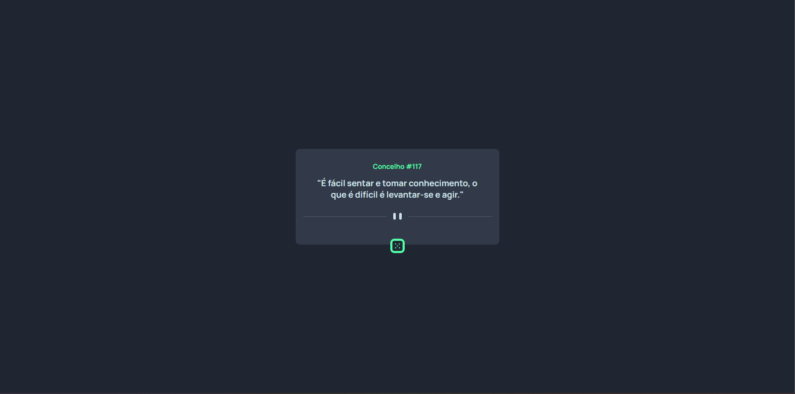
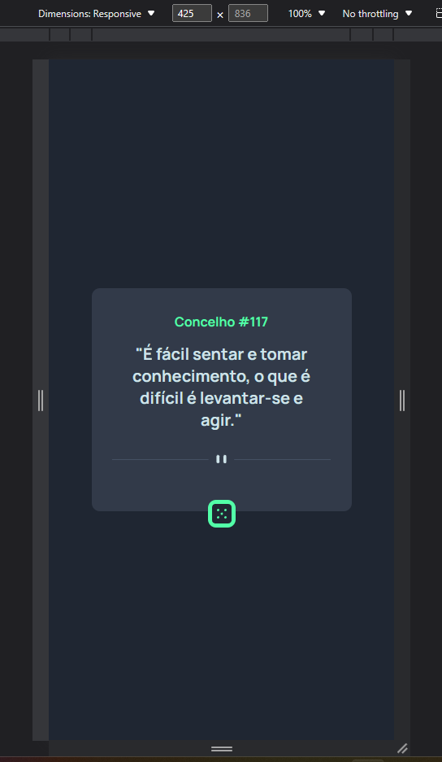

# Exercicío HTML e CSS avançado #

Descrição da tarefa: Você deve criar um layout próximo desse desafio do frontend mentor: Frontend Mentor | Advice generator app coding challenge. Onde o principal desafio é construir um aplicativo que gere conselhos aleatórios. Nessa primeira etapa do exercício, será realizado apenas a construção do HTML e CSS.

## Design desktop ##

## Design Mobile

## Tecnologias usadas
- HTML 5
- CSS